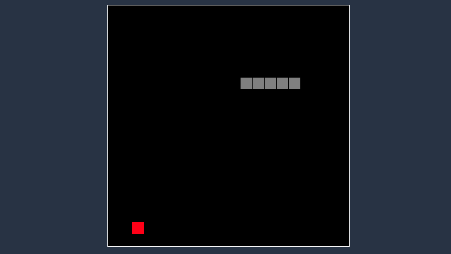

<h1 align="center">
    
</h1>

<h4 align="center"> 
	Snake Game
</h4>

  

  
 
  

  
   

 

## 💻 Sobre o projeto

Serpente (Snake, também conhecido como "jogo da cobrinha") é um jogo que ficou conhecido por diversas versões cuja versão inicial começou com o jogo Blockade de 1976, sendo feitas várias imitações em vídeo-games e computadores. No fim dos anos 90 foi popularizado em celulares da Nokia que vinham com o jogo já incluso (Wikipédia).

Este projeto busca recriar o jogo utilizando JavaScript, para ser jogado utilizando seu navegador.

 

 

## 🛠 Tecnologias

As seguintes ferramentas foram usadas na construção do projeto:

- HTML5
- CSS
- JavaScript

 

 

## 🚀 Como executar o projeto

Basta fazer o download do projeto e executar o arquivo index.js no seu navegador ou [clicar aqui](https://andrefmsouza.github.io/snake-game/) para jogar online.

 

 

## 😯 Como contribuir para o projeto

1. Faça um **fork** do projeto.
2. Crie uma nova branch com as suas alterações: `git checkout -b my-feature`
3. Salve as alterações e crie uma mensagem de commit contando o que você fez: `git commit -m "feature: My new feature"`
4. Envie as suas alterações: `git push origin my-feature`
> Caso tenha alguma dúvida confira este [guia de como contribuir no GitHub](https://github.com/firstcontributions/first-contributions)

 

 

## 📝 Licença

Este projeto esta sobe a licença MIT.

Feito com ❤️ por André Souza 👋🏽 [Entre em contato!](https://www.linkedin.com/in/andrefmsouza/)

[license]: https://opensource.org/licenses/MIT
